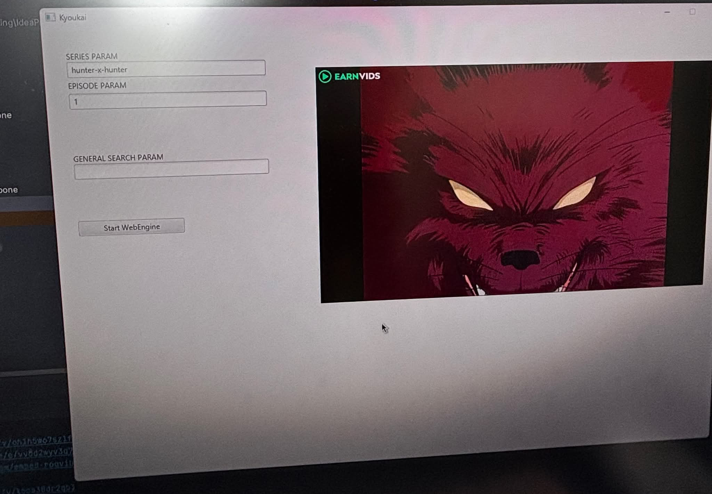

# Kyoukai - Anime Recommendation & Streaming App

Kyoukai is a simple JavaFX-based application that allows users to discover new, popular, and recommended anime through various APIs. The app not only shows information about these anime but also provides direct streaming links from different platforms.

## Features

- **Anime Discovery**: Browse through the latest, most popular, and recommended anime titles.
- **Direct Streaming Links**: Get direct links to streaming platforms for watching the anime.
- **JavaFX UI**: A clean and user-friendly graphical interface built with JavaFX.

## Technologies Used

- **JavaFX**: For building the desktop application with a rich user interface.
- **APIs**: The app fetches anime data from various APIs (e.g., [Jikan API](https://jikan.moe/), [AniList API](https://anilist.co/)).
- **External Streaming Platforms**: Direct streaming links from platforms such as Crunchyroll, Funimation, and others.
